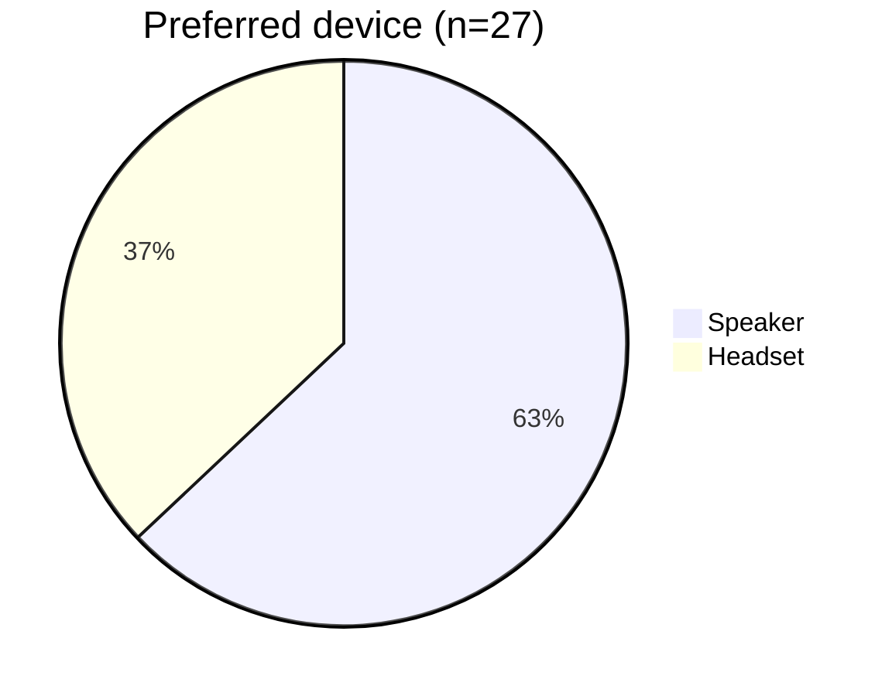
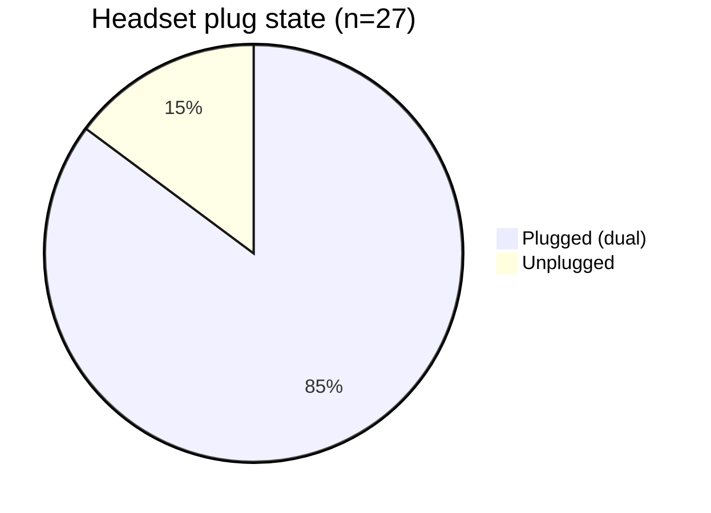
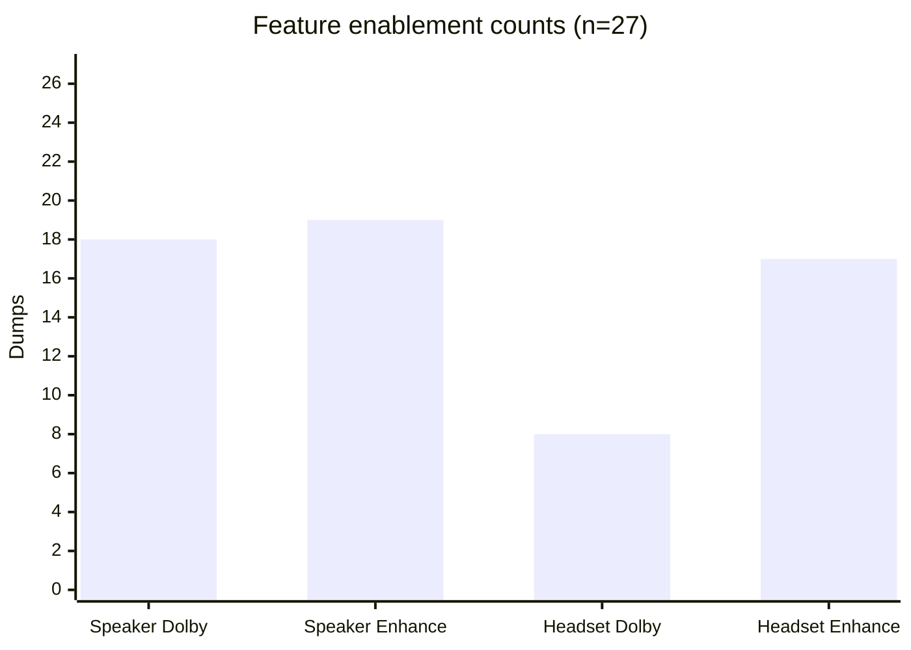

# RtHDDump Token Inference Report

## Abstract

This report summarizes 27 RtHDDump captures in this repository by interpreting filename tokens that encode device state. The inferred variables include preferred device, headset plug state, Dolby mode, and system audio enhancement flags. Counts and proportions are reported with charts and tables to make the filename changes easy to interpret at a glance.

## Data and methods

- Source data: `rthddump_summary.csv` generated by `rthddump_report.py`.
- Tokens and interpretations:
  - `spk` = speaker, `h` = headset.
  - First device token = preferred device.
  - `dual` = headset plugged (absence = unplugged).
  - `dolby`/`dolbys` = Dolby for speaker, `dolbyh` = Dolby for headset.
  - `enhance` after `spk` = speaker system audio enhancement, `enhance` after `h` = headset system audio enhancement.
- Statistics: simple counts and proportions across all dumps.

### Inferred token dictionary (final interpretation)

| Token | Meaning |
| --- | --- |
| `spk` | Speaker device path |
| `h` | Headset device path |
| `dual` | Headset plugged in (absence means unplugged) |
| `dolby`, `dolbys` | Dolby enabled for speaker |
| `dolbyh` | Dolby enabled for headset |
| `enhance` after `spk` | Speaker system audio enhancement enabled |
| `enhance` after `h` | Headset system audio enhancement enabled |

## Results

### Dataset overview

| Metric | Count | Share |
| --- | --- | --- |
| Total RtHDDump files | 27 | 100% |
| Preferred device = speaker | 17 | 63.0% |
| Preferred device = headset | 10 | 37.0% |
| Headset plugged | 23 | 85.2% |
| Headset unplugged | 4 | 14.8% |

### Figure 1. Preferred device distribution



### Figure 2. Headset plug state



### Feature enablement

| Feature | Enabled | Disabled | Enable rate |
| --- | --- | --- | --- |
| Speaker Dolby | 18 | 9 | 66.7% |
| Speaker system audio enhancement | 19 | 8 | 70.4% |
| Headset Dolby | 8 | 19 | 29.6% |
| Headset system audio enhancement | 17 | 10 | 63.0% |

### Figure 3. Feature enablement counts



### Data quality checks

| Check | Result |
| --- | --- |
| Files with unknown filename tokens | 0 |
| Files with recorded SHA-256 in CSV | 27 |

## Discussion

Most dumps favor the speaker as the preferred device, while the headset is plugged in for the majority of captures. Speaker Dolby and speaker enhancement appear more frequently than the corresponding headset features, suggesting the speaker path is typically configured with additional processing in this dataset. Headset Dolby is present in fewer than one-third of dumps, while headset enhancement appears in roughly two-thirds, indicating distinct tuning profiles depending on the device path.

## Conclusion

The filename tokens consistently encode device selection and processing features. The dataset is dominated by speaker-preferred configurations with headset plugged in, and speaker processing features appear more frequently than headset Dolby. The full per-file inference table below provides the definitive mapping from each dump to its inferred device state.

## Appendix A: Per-file inference results

| File | Preferred | Headset plugged | Speaker Dolby | Speaker Enhance | Headset Dolby | Headset Enhance |
| --- | --- | --- | --- | --- | --- | --- |
| RtHDDump_dual_h_dolby_enhance_spk_dolby.txt | headset | True | True | False | False | True |
| RtHDDump_dual_h_dolby_enhance_spk_dolby_enhance.txt | headset | True | True | True | False | True |
| RtHDDump_dual_h_dolby_enhance_spk_enhance.txt | headset | True | True | True | False | True |
| RtHDDump_dual_h_dolby_spk_dolby.txt | headset | True | True | False | False | False |
| RtHDDump_dual_h_dolby_spk_dolby_enhance.txt | headset | True | True | True | False | False |
| RtHDDump_dual_h_dolby_spk_enhance.txt | headset | True | True | True | False | False |
| RtHDDump_dual_h_enhance_spk_dolby.txt | headset | True | True | False | False | True |
| RtHDDump_dual_h_enhance_spk_dolby_enhance.txt | headset | True | True | True | False | True |
| RtHDDump_dual_h_enhance_spk_enhance.txt | headset | True | False | True | False | True |
| RtHDDump_dual_h_spk_dolby_enhance.txt | headset | True | True | True | False | False |
| RtHDDump_dual_spk_dolbyh_enhance_h_dolbyh_enhance.txt | speaker | True | False | True | True | True |
| RtHDDump_dual_spk_dolbyh_enhance_h_enhance.txt | speaker | True | False | True | True | True |
| RtHDDump_dual_spk_dolbyh_h_dolbyh_enhance.txt | speaker | True | False | False | True | True |
| RtHDDump_dual_spk_dolbys_enhance_h_dolbyh.txt | speaker | True | True | True | True | False |
| RtHDDump_dual_spk_dolbys_enhance_h_dolbyh_enhance.txt | speaker | True | True | True | True | True |
| RtHDDump_dual_spk_dolbys_enhance_h_dolbys.txt | speaker | True | True | True | False | False |
| RtHDDump_dual_spk_dolbys_enhance_h_dolbys_enhance.txt | speaker | True | True | True | False | True |
| RtHDDump_dual_spk_dolbys_enhance_h_enhance.txt | speaker | True | True | True | False | True |
| RtHDDump_dual_spk_dolbys_h_dolbyh_enhance.txt | speaker | True | True | False | True | True |
| RtHDDump_dual_spk_enhance_h_dolbyh_enhance.txt | speaker | True | False | True | True | True |
| RtHDDump_dual_spk_enhance_h_dolbys_enhance.txt | speaker | True | True | True | False | True |
| RtHDDump_dual_spk_enhance_h_enhance.txt | speaker | True | False | True | False | True |
| RtHDDump_dual_spk_h_dolbyh_enhance.txt | speaker | True | False | False | True | True |
| RtHDDump_spk.txt | speaker | False | False | False | False | False |
| RtHDDump_spk_dolby.txt | speaker | False | True | False | False | False |
| RtHDDump_spk_dolby_enhance.txt | speaker | False | True | True | False | False |
| RtHDDump_spk_enhance.txt | speaker | False | False | True | False | False |

## Appendix B: Regeneration

Generate the CSV summary and the PDF report from the current dumps:

```bash
python rthddump_report.py --output rthddump_summary.csv
typst compile RtHDDump_Report.typ RtHDDump_Report.pdf
```
