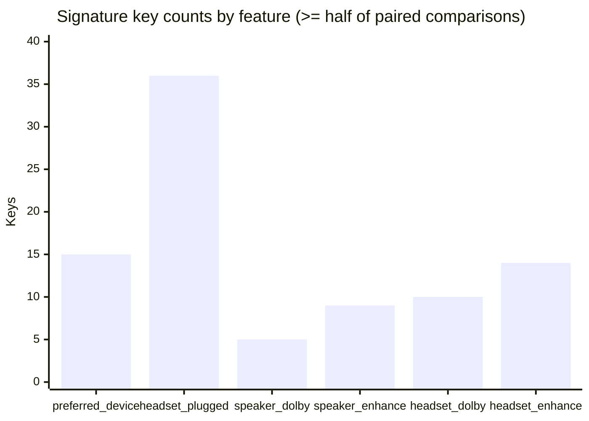

# RtHDDump Content Difference Report

## Abstract

This report investigates RtHDDump file *content* differences and their relationship to device states (preferred device, headset plug state, and Dolby/enhancement modes). The analysis focuses on WID lines and registry-style key/value entries inside each dump rather than relying on filename tokens. We find that WID lines are identical across all dumps, while the state changes consistently align with differences in specific `REG_*` keys.

## Data and methods

- Dataset: 27 RtHDDump captures.
- WID analysis: extract all lines starting with `Wid=` and compare across files.
- Content difference analysis: extract key/value lines (`<key> = <value>`).  
- Paired comparison method: for each device state, match files with all other states held constant and compare their key/value lines. A key is a *signature* when it changes in ≥ half of the paired comparisons for that state.
- Values are trimmed for readability (`prefix…suffix`) but still show the changing portions.

## Results

### WID section stability

All 27 files contain the same 11 WID lines with identical values, indicating that the device-state verbs are **not** encoded by WID changes in this dataset.

| WID | Codec | Drv | Loc |
| --- | --- | --- | --- |
| 12 | 40000000 | 40000000 | 00000000 |
| 13 | 411111F0 | 411111F0 | 00000000 |
| 14 | 90170120 | 90170120 | 00000000 |
| 17 | 90170120 | 90170120 | 00000000 |
| 18 | 81D111F0 | — | — |
| 19 | 03A11030 | 03A11030 | 00080000 |
| 1A | 411111F0 | 411111F0 | 00020400 |
| 1B | 411111F0 | 411111F0 | 00000000 |
| 1D | 40471A6D | 411111F0 | 00000000 |
| 1E | 411111F0 | 411111F0 | 00000700 |
| 21 | 03211010 | 03211010 | 00020000 |

### Feature difference summary

| Feature | Paired comparisons | Keys ≥ half pairs | Keys all pairs |
| --- | --- | --- | --- |
| preferred_device | 3 | 15 | 8 |
| headset_plugged | 1 | 36 | 36 |
| speaker_dolby | 6 | 5 | 3 |
| speaker_enhance | 6 | 9 | 3 |
| headset_dolby | 3 | 10 | 10 |
| headset_enhance | 4 | 14 | 3 |



### Preferred device signatures

| Key | Coverage | Speaker preferred | Headset preferred |
| --- | --- | --- | --- |
| `(REG_BINARY) {1e94c58f-3e40-4ddb-b10c-a86d8b870a31},2` | 3/3 | `02 00 00 00 01 00 00 00 EF 06` | `02 00 00 00 01 00 00 00 EF 01` |
| `(REG_BINARY) Position` | 3/3 | `01 00 00 00 00 00 00 00 00 00 00 00 00 0…0 00 00 00 00 00` | `01 00 00 00 00 00 00 00 00 00 00 00 00 0…0 00 00 00 00 00` |
| `(REG_BINARY) {1b4dab55-b1fb-4d8c-8317-f2d4a96efbb8},4` | 3/3 | `41 00 00 00 01 00 00 00 01 00 01 00 01 0…0 00 40 34 00 00` | `41 00 00 00 01 00 00 00 01 00 01 00 01 0…2 00 20 23 00 00` |
| `(REG_SZ) {24dbb0fc-9311-4b3d-9cf0-18ff155639d4},0` | 3/3 | `{0.0.0.00000000}.{36e664d4-3174-4fd5-ace4-5287bc0bdf22}` | `{0.0.0.00000000}.{105abd99-be3c-4986-856c-3f24ec337b55}` |
| `(REG_BINARY) {bb8bdb4a-edac-4660-9056-8e67e68e4e77},4` | 3/3 | `41 00 00 00 01 00 00 00 C7 1B 04 75 36 2…3 E0 37 6D 08 5A` | `41 00 00 00 01 00 00 00 0B B9 7A 91 18 0…9 1A 56 F8 04 5A` |

### Headset plug signatures

| Key | Coverage | Headset plugged | Headset unplugged |
| --- | --- | --- | --- |
| `(REG_DWORD) InternalSpeakerStreamActive` | 1/1 | `0x0000` | `0x0001` |
| `(REG_BINARY) {5510c7ab-dfc2-40d0-a98b-5f77f697005e},2` | 1/1 | `03 00 00 00 01 00 00 00 28 00 00 00` | `03 00 00 00 01 00 00 00 00 00 00 00` |
| `(REG_BINARY) {5510c7ab-dfc2-40d0-a98b-5f77f697005e},1` | 1/1 | `03 00 00 00 01 00 00 00 08 00 00 00` | `03 00 00 00 01 00 00 00 02 00 00 00` |
| `(REG_DWORD) {3ba0cd54-830f-4551-a6eb-f3eab68e3700},6` | 1/1 | `0x0000` | `0x0001` |
| `(REG_BINARY) {194ef948-7cdb-403e-9f47-19418f7b24fd},2` | 1/1 | `40 00 00 00 01 00 00 00 8D F3 96 28 D4 9A DC 01` | `40 00 00 00 01 00 00 00 59 36 9F D1 D3 9A DC 01` |

### Speaker Dolby signatures

| Key | Coverage | Speaker Dolby on | Speaker Dolby off |
| --- | --- | --- | --- |
| `(REG_BINARY) Position` | 6/6 | `01 00 00 00 00 00 00 00 00 00 00 00 00 0…0 00 00 00 00 00` | `01 00 00 00 00 00 00 00 00 00 00 00 00 0…0 00 00 00 00 00` |
| `(REG_BINARY) {1b4dab55-b1fb-4d8c-8317-f2d4a96efbb8},4` | 6/6 | `41 00 00 00 01 00 00 00 01 00 01 00 01 0…2 00 20 23 00 00` | `41 00 00 00 01 00 00 00 01 00 01 00 01 0…2 00 60 23 00 00` |
| `(REG_BINARY) {1b4dab55-b1fb-4d8c-8317-f2d4a96efbb8},1` | 6/6 | `41 00 00 00 01 00 00 00 01 00 01 00 01 0…2 00 20 23 00 00` | `41 00 00 00 01 00 00 00 01 00 01 00 01 0…2 00 60 23 00 00` |
| `(REG_BINARY) {1e94c58f-3e40-4ddb-b10c-a86d8b870a31},2` | 4/6 | `02 00 00 00 01 00 00 00 20 0C` | `02 00 00 00 01 00 00 00 EF 07` |
| `(REG_BINARY) {8a845654-d6c3-4cd7-b4eb-243d4bd99032},2` | 3/6 | `41 00 00 00 01 00 00 00 00 00 00 00 00 0…E F9 95 53 37 90` | `41 00 00 00 01 00 00 00 00 00 00 00 00 0…0 00 00 00 00 00` |

### Speaker enhancement signatures

| Key | Coverage | Speaker enhancement on | Speaker enhancement off |
| --- | --- | --- | --- |
| `(REG_BINARY) Position` | 6/6 | `01 00 00 00 00 00 00 00 00 00 00 00 00 0…0 00 00 00 00 00` | `01 00 00 00 00 00 00 00 00 00 00 00 00 0…0 00 00 00 00 00` |
| `(REG_BINARY) {1b4dab55-b1fb-4d8c-8317-f2d4a96efbb8},4` | 6/6 | `41 00 00 00 01 00 00 00 01 00 01 00 01 0…2 00 20 23 00 00` | `41 00 00 00 01 00 00 00 01 00 01 00 01 0…2 00 A0 23 00 00` |
| `(REG_BINARY) {1b4dab55-b1fb-4d8c-8317-f2d4a96efbb8},1` | 6/6 | `41 00 00 00 01 00 00 00 01 00 01 00 01 0…2 00 20 23 00 00` | `41 00 00 00 01 00 00 00 01 00 01 00 01 0…2 00 A0 23 00 00` |
| `(REG_BINARY) {1e94c58f-3e40-4ddb-b10c-a86d8b870a31},2` | 5/6 | `02 00 00 00 01 00 00 00 EF 01` | `02 00 00 00 01 00 00 00 EF 02` |
| `(REG_DWORD) {1da5d803-d492-4edd-8c23-e0c0ffee7f0e},5` | 4/6 | `∅` | `0x0001` |

### Headset Dolby signatures

| Key | Coverage | Headset Dolby on | Headset Dolby off |
| --- | --- | --- | --- |
| `(REG_BINARY) {8a845654-d6c3-4cd7-b4eb-243d4bd99032},2` | 3/3 | `41 00 00 00 01 00 00 00 00 00 00 00 00 0…F E8 0F 4D 39 5D` | `41 00 00 00 01 00 00 00 00 00 00 00 00 0…0 00 00 00 00 00` |
| `(REG_BINARY) {1e94c58f-3e40-4ddb-b10c-a86d8b870a31},2` | 3/3 | `02 00 00 00 01 00 00 00 EF 07` | `02 00 00 00 01 00 00 00 EF 05` |
| `(REG_BINARY) Position` | 3/3 | `01 00 00 00 00 00 00 00 00 00 00 00 00 0…0 00 00 00 00 00` | `01 00 00 00 00 00 00 00 00 00 00 00 00 0…0 00 00 00 00 00` |
| `(REG_BINARY) {1b4dab55-b1fb-4d8c-8317-f2d4a96efbb8},4` | 3/3 | `41 00 00 00 01 00 00 00 01 00 01 00 01 0…0 00 80 34 00 00` | `41 00 00 00 01 00 00 00 01 00 01 00 01 0…2 00 C0 33 00 00` |
| `(REG_BINARY) {6737016f-5360-48ee-af05-e616c8ff27a7},2` | 3/3 | `02 00 00 00 01 00 00 00 04 00` | `02 00 00 00 01 00 00 00 00 00` |

### Headset enhancement signatures

| Key | Coverage | Headset enhancement on | Headset enhancement off |
| --- | --- | --- | --- |
| `(REG_BINARY) Position` | 4/4 | `01 00 00 00 00 00 00 00 00 00 00 00 00 0…0 00 00 00 00 00` | `01 00 00 00 00 00 00 00 00 00 00 00 00 0…0 00 00 00 00 00` |
| `(REG_BINARY) {1b4dab55-b1fb-4d8c-8317-f2d4a96efbb8},4` | 4/4 | `41 00 00 00 01 00 00 00 01 00 01 00 01 0…2 00 A0 23 00 00` | `41 00 00 00 01 00 00 00 01 00 01 00 01 0…2 00 20 24 00 00` |
| `(REG_BINARY) {1b4dab55-b1fb-4d8c-8317-f2d4a96efbb8},1` | 4/4 | `41 00 00 00 01 00 00 00 01 00 01 00 01 0…2 00 A0 23 00 00` | `41 00 00 00 01 00 00 00 01 00 01 00 01 0…2 00 20 24 00 00` |
| `(REG_BINARY) {1e94c58f-3e40-4ddb-b10c-a86d8b870a31},2` | 3/4 | `02 00 00 00 01 00 00 00 EF 01` | `02 00 00 00 01 00 00 00 EF 02` |
| `(REG_BINARY) {624f56de-fd24-473e-814a-de40aacaed16},3` | 2/4 | `41 00 00 00 01 00 00 00 FE FF 02 00 80 B…0 AA 00 38 9B 71` | `∅` |

## Conclusion

The device-state verbs are reflected in **registry key/value differences**, not WID line changes. Preferred device and headset plug state show strong, consistent content signatures, while Dolby and enhancement states show fewer but still repeatable key changes across paired comparisons. The signature tables above provide the definitive, content-based mapping from each state to the specific keys that change.

## Appendix: Regeneration

Generate the CSV summary and the PDF report from the current dumps:

```bash
python rthddump_report.py --output rthddump_summary.csv
typst compile RtHDDump_Report.typ RtHDDump_Report.pdf
```
